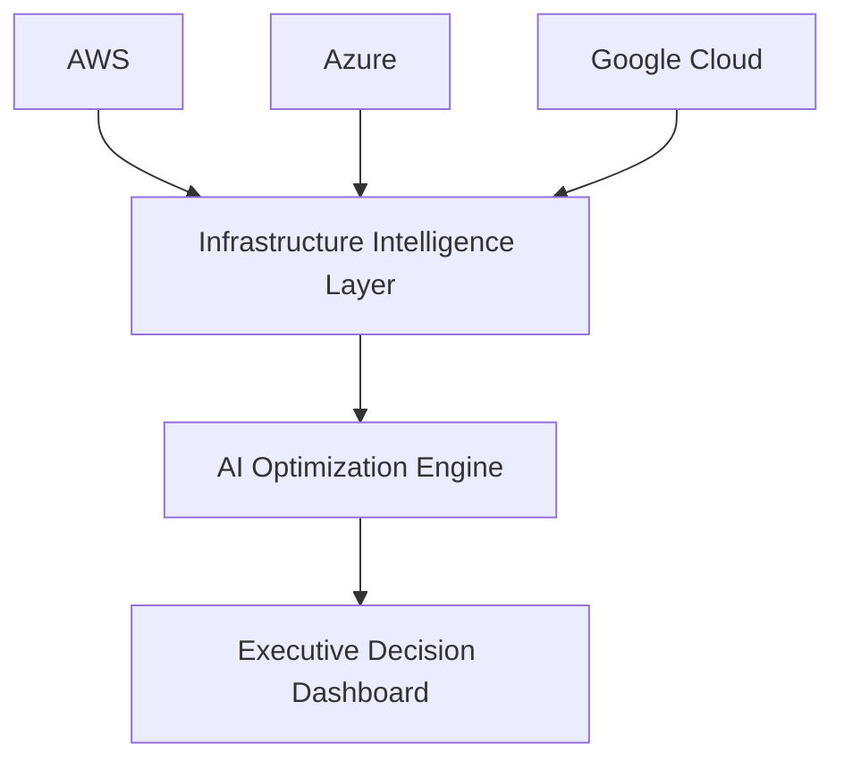

# AI Infrastructure Intelligence Platform
### Enterprise AI Infrastructure Intelligence for Multi-Cloud GPU & ML Workloads
> Optimized multi-cloud AI infrastructure, identifying $5.4M in projected savings, reducing cloud spend by 59%, and redirecting infrastructure investment toward customer-facing AI innovation.
---

### Modern enterprises no longer optimize cloud infrastructure simply to reduce cost—they optimize it to increase AI capability.
> Today, infrastructure decisions directly influence deployment speed, innovation velocity, GPU utilization, governance, inference economics, and ultimately an organization's ability to bring intelligent products to market.
---

### Executive Summary
> This platform demonstrates how enterprise AI infrastructure can be continuously optimized through the integration of cloud architecture, FinOps, MLOps, and intelligent decision systems. By transforming infrastructure telemetry into actionable business intelligence, organizations can improve AI deployment economics, optimize GPU utilization, and reinvest operational savings into innovation.
---

### Strategic Outcomes

| Metric | Result |
|--------|--------|
| AI Infra Savings | **$5.4M** |  
| Cloud Cost Reduction | **59% reduction** |
| ML Infra Savings  | **$1M+ annually** |
| GPU Optimization | **Multi-cloud placement strategy** |
| AI Innovation Funding | **Reinvested into customer-facing AI**|
| Departments under budget | **All 8 — for 24 consecutive months** |
| SLA degradation during optimization | **Zero** |
---

### The Business Problem
As enterprises deploy increasingly complex AI workloads across AWS, Azure, and Google Cloud, infrastructure decisions directly influence model performance, inference cost, GPU utilization, and innovation velocity.
> The limiting factor is no longer cloud spend—it is the ability to intelligently allocate infrastructure across increasingly complex AI workloads.
---

### AI Infrastructure Intelligence Framework

 - GPU workload placement optimization
 - Training vs. inference cost modeling
 - Cross-cloud AI workload balancing
 - AI infrastructure forecasting
 - ML resource utilization analysis
 - Intelligent rightsizing recommendations
 - AI-ready capacity planning   
---

### Reference Architecture

---

### AI Infrastructure Roadmap

 - AI-powered anomaly detection
 - Autonomous FinOps recommendations
 - LLM-based cloud optimization assistant
 - Multi-agent infrastructure optimization
 - Predictive GPU capacity forecasting
 - Autonomous workload placement
 - Natural language FinOps querying   
---

### Why This Matters

> Today's AI leaders are constrained less by model capability than by infrastructure efficiency.

#### Organizations that allocate GPU capacity wisely, optimize inference economics, and continuously govern their AI infrastructure will deploy models faster, operate at lower cost, and reinvest savings into competitive innovation.

> This platform demonstrates how AI infrastructure can evolve from a cost center into a strategic advantage.
---

### Data & Reproducibility

Modeled on an actual project. All data is fully synthetic — anonymized patterns modeled on realistic AWS + GCP billing structures. No real account info, PII, or proprietary data.

| File | Description |
|------|-------------|
| `finops_budget_tracking.csv` | 24 months budget vs. actual by department |
| `finops_cloud_costs.csv` | Detailed costs by provider, service, environment |

**To reproduce:**
1. Download CSV files or connect your own billing exports
2. Connect in Tableau Public or Desktop
3. Customize filters and annotations for your context
4. Publish and share

##### Analysis period: January 2023 – December 2024
##### Tools: Tableau Public, Python (data validation)
---

### Enterprise AI Architecture Portfolio
> This repository is part of a broader portfolio exploring enterprise AI transformation through:

- AI Infrastructure Intelligence
- Enterprise Agent Platforms
- Infrastructure Due Diligence Intelligence
- AI Governance & Decision Systems
- Data Engineering & AI Foundations
- Linux, Kubernetes & Cloud Platforms

> Each project explores a different layer of the enterprise AI operating model.
#### Together, these projects demonstrate how enterprise AI can be architected, governed, optimized, and translated into measurable business outcomes.
---

*Built by Tracy Anne Griffin Manning | Apex AI|ML Engineering*
*[LinkedIn](www.linkedin.com/in/tracy-manning-systems-architect) | [Tableau Dashboard](https://tinyurl.com/mr3a9yce)*
