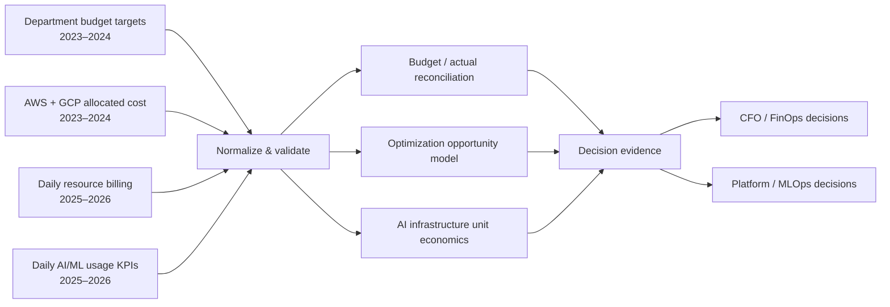

# AI Infrastructure Intelligence Platform
### Evidence-led FinOps for multi-cloud AI infrastructure

> **Cloud optimization is not a contest to produce the largest savings number. It is a decision system: establish the baseline, reconcile spend, identify the next best action, and preserve the evidence behind the decision.**

This repository models that decision loop across AWS and Google Cloud using fully synthetic data. It combines executive budget tracking, detailed cloud cost allocation, daily resource billing, and AI/ML usage telemetry so infrastructure economics can be examined from both a finance and platform-engineering perspective.

## Executive decision summary

Every headline number below is reproducible from the committed datasets.

| Decision metric | Verified result | Evidence window |
| --- | ---: | --- |
| Modeled budget baseline | **$9,195,768.72** | Jan 2023 – Dec 2024 |
| Modeled actual cloud spend | **$3,812,936.30** | Jan 2023 – Dec 2024 |
| Budget-to-actual variance | **$5,382,832.42** | Jan 2023 – Dec 2024 |
| Spend below modeled budget | **58.5%** | Jan 2023 – Dec 2024 |
| Departments under monthly budget | **8 of 8, all 24 months** | Jan 2023 – Dec 2024 |
| Additional modeled optimization opportunity | **$207,406.70** | Jan 2023 – Dec 2024 |
| Opportunity as share of actual spend | **5.4%** | Jan 2023 – Dec 2024 |
| AWS / GCP actual spend mix | **59.3% / 40.7%** | Jan 2023 – Dec 2024 |

The `$5.38M` figure is intentionally described as **budget-to-actual variance**, not automatically as realized savings. The separate `$207.4K` figure represents modeled optimization opportunities still present in the detailed cost data.

### Optimization backlog

| Opportunity class | Modeled opportunity |
| --- | ---: |
| Reserved Instance candidates | **$130,453.01** |
| Potential waste | **$45,983.85** |
| Right-sizing opportunities | **$30,969.84** |
| **Total** | **$207,406.70** |

The largest service-level opportunities are concentrated in EC2, Compute Engine, RDS, BigQuery, EBS, and Cloud SQL.

## The second evidence window: AI infrastructure operations

The repository also contains a separate 90-day operational extension from **November 3, 2025 through January 31, 2026**. It is not blended into the 2023–2024 executive baseline.

| Operational metric | Verified result |
| --- | ---: |
| Daily billing rows | **8,548** |
| Modeled 90-day spend | **$94,410.59** |
| Modeled GPU spend | **$25,829.78** |
| GPU resource records | **915** |
| Daily usage KPI rows | **450** |
| Model inferences | **280,915** |
| Application requests | **15,831,113** |

This second window creates the bridge from traditional FinOps into **AI infrastructure unit economics**: cloud cost can be viewed alongside requests, jobs, processed data, and model inference volume.

## Decision contract

The repository follows four rules:

1. **A budget gap is not automatically called savings.** It is reported as variance unless the evidence proves realized savings.
2. **Candidate savings are not booked savings.** Potential optimization is kept separate from historical spend.
3. **Time windows do not silently mix.** The 2023–2024 executive baseline and 2025–2026 operational telemetry are analyzed independently.
4. **Headline claims must be reproducible.** The verification module recomputes the metrics from the committed source files and fails if reconciliation breaks.

That distinction is the difference between a dashboard that looks persuasive and an analytical system that can support a decision.

## Implemented analytical flow


```mermaid
flowchart LR
    Budget["Department budget targets<br/>2023–2024"]
    Cost["AWS + GCP allocated cost<br/>2023–2024"]
    Billing["Daily resource billing<br/>2025–2026"]
    Usage["Daily AI/ML usage KPIs<br/>2025–2026"]

    Normalize["Normalize & validate"]
    Reconcile["Budget / actual reconciliation"]
    Opportunity["Optimization opportunity model"]
    Economics["AI infrastructure unit economics"]
    Evidence["Decision evidence"]

    Budget --> Normalize
    Cost --> Normalize
    Billing --> Normalize
    Usage --> Normalize

    Normalize --> Reconcile
    Normalize --> Opportunity
    Normalize --> Economics

    Reconcile --> Evidence
    Opportunity --> Evidence
    Economics --> Evidence

    Evidence --> CFO["CFO / FinOps decisions"]
    Evidence --> Platform["Platform / MLOps decisions"]
```

## What the data says

For the 2023–2024 modeled baseline:

- AWS accounts for **$2.262M** of spend and GCP **$1.551M**.
- Production represents **$3.111M** of the **$3.813M** actual spend.
- The committed budget table and detailed cloud-cost table reconcile to the same **$3,812,936.30** actual total.
- Every department remains below its modeled monthly budget for all 24 periods.
- Data Science has the largest modeled optimization backlog at about **$32.6K**, followed by Engineering at about **$30.4K**.

For the 2025–2026 operational extension:

- GCP represents **$64.9K** of the 90-day modeled spend and AWS **$29.5K**.
- GPU-tagged resource spend totals **$25.8K**, split between modeled L4 and A10 resource types.
- MLOps generates the largest inference volume; Platform generates the largest request volume.

These are **observations from the synthetic scenario**, not claims about a live production estate.

## Repository structure

```text
.
├── data/
│   ├── finops_budget_tracking.csv
│   ├── finops_cloud_costs.csv
│   ├── finops_billing_daily.csv
│   └── finops_usage_kpis_daily.csv
├── docs/
│   ├── DATA_DICTIONARY.md
│   ├── METRIC_LINEAGE.md
│   └── images/
│       ├── dashboard-01.jpg
│       └── dashboard-02.jpg
├── src/
│   └── finops_intelligence/
│       ├── __init__.py
│       └── metrics.py
├── tests/
│   └── test_metrics.py
├── .github/workflows/ci.yml
└── README.md
```

## Reproduce the evidence

The analytical verifier uses only the Python standard library.

```bash
PYTHONPATH=src python -m finops_intelligence.metrics --data-dir data --verify
PYTHONPATH=src python -m unittest discover -s tests -v
```

The verifier checks, among other things:

- actual spend reconciles across the budget and detailed cost datasets;
- all 192 department-month observations are below their modeled budgets;
- the optimization backlog reconciles to its component opportunity classes;
- the operational billing and usage datasets cover the same 90-day window;
- GPU spend is calculated only from resource types explicitly tagged as GPU resources.

CI runs compilation, tests, deterministic metric verification, and a whitespace check on every push and pull request.

## Data provenance and limitations

All data in this repository is **fully synthetic**. It is modeled on realistic enterprise cloud billing and FinOps patterns, but it contains no real cloud account information, customer data, PII, or proprietary billing records.

The project contains two intentionally separate analytical periods:

- **Executive baseline:** January 2023 – December 2024.
- **Operational AI infrastructure extension:** November 3, 2025 – January 31, 2026.

See [DATA_DICTIONARY.md](docs/DATA_DICTIONARY.md) for dataset grain and [METRIC_LINEAGE.md](docs/METRIC_LINEAGE.md) for formulas and interpretation rules.

## Portfolio framing

This project is not intended to simulate an entire FinOps commercial platform. It demonstrates the architectural judgment behind one:

**cost telemetry → normalization → reconciliation → opportunity → evidence → business decision**

The most important design choice is not the dashboard. It is the boundary between **what the data proves**, **what the model estimates**, and **what the business chooses to do next**.

---

Built by Tracy Anne Griffin Manning  
[LinkedIn](https://www.linkedin.com/in/tracy-manning-systems-architect) · [Tableau Dashboard](https://tinyurl.com/mr3a9yce)
